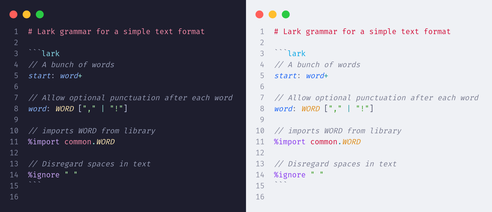

# Lark for Visual Studio Code

This extension provides language support for Lark grammar files in Visual Studio Code.



Contributions are greatly appreciated.
Please fork this repository and open a pull request to make grammar tweaks, add support for other subgrammars etc.

## ✨ Features

- ✅ Syntax highlighting for:
  - Rule definition
  - Terminal definition
  - Directives
  - Operators
  - Comments (//, /* ... */, --)
  - Strings (quoted & backticked)
- ✅ Markdown embedding support
- ✅ Custom file icon for `.lark` files

## 📦 Installation

1. Open Visual Studio Code.
2. Go to the Extensions view by clicking on the Extensions icon in the Activity Bar on the side of the window or by pressing `Ctrl+Shift+X`.
3. Search for "New Relic Query Language" or "Lark".
4. Click on the "Install" button for the extension named "New Relic Query Language (Lark) for Visual Studio Code".
5. Once installed, you can start using Lark syntax highlighting in your `.lark` files.
6. Optionally, you can set the default language for `.lark` files by adding the following to your `settings.json`:

```json
"files.associations": {
    "*.lark": "lark"
}
```

## Release Notes

All changes are listed in our [change log ↗][changelog].

## Contributing

Contributions are greatly appreciated.

Please fork this repository and open a pull request to make grammar tweaks, add support for other subgrammars etc.

## Contributors

See the list of contributors in our [contributors page ↗][contributors].

## License

## License

This project is licensed under the terms of the Apache-2.0 license. See the
[LICENSE ↗][license] file.


[contributors]: https://github.com/lark-parser/vscode-lark/graphs/contributors
[changelog]: CHANGELOG.md
[license]: LICENSE
